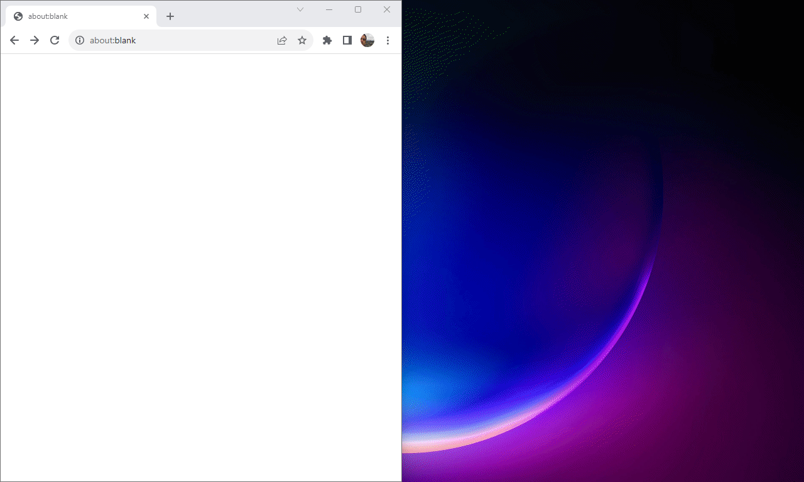

# Playwright CRX

This package contains the [Chrome Extensions](https://developer.chrome.com/docs/extensions/) flavor of the [Playwright](http://github.com/microsoft/playwright) library.

For that, it relies on [`chrome.debugger`](https://developer.chrome.com/docs/extensions/reference/debugger/) to implement [playwright's `ConnectionTransport`](https://github.com/microsoft/playwright/blob/f8a30fb726bc35d4058a2d010b2ed5f6ca2409a3/packages/playwright-core/src/server/transport.ts#L54) interface.

**NOTE:** If you want to write end-to-end tests, you should use [@playwright/test](https://playwright.dev/docs/intro) instead.

## Recorder / Player

**Note:** This extension is available in [Chrome Web Store](https://chrome.google.com/webstore/detail/playwright-crx/jambeljnbnfbkcpnoiaedcabbgmnnlcd).

A small demo of recorder and player in action:



It provides playwright recorder (the same used in `playwright codegen`) bundled as a chrome extension, with no other dependencies.
This way, with your normal chrome / chromium / edge browser, you can record playwright scripts in your prefered language.

In terms of chrome extension functionality, it provides:

- [action button](https://developer.chrome.com/docs/extensions/reference/action/) for attaching current tab into recorder (it opens the recorder if it's closed)
- [context menu](https://developer.chrome.com/docs/extensions/reference/contextMenus/) for the same purpose
- pages must be explicitly attached to be recordable, except if they are opened from already attached pages
- closing the recorder window will detach all pages and uninstall injected scripts (highlights and event listeners)
- a player that will run the recorded instructions, in any supported language*
   - it actually doesn't run Java, Python or C#, but it uses an internal JSONL format to know which instructions it needs to run and how to map them into the current selected code. This way, it can highlight the lines being executed.

## API

It's possible to use `playwright-crx` as a library to create new chrome extensions.

Here's a simple example of a background service worker for a chrome extension using **playwright-crx**:

```ts
import { crx, expect } from 'playwright-crx/test';

// if you don't need assertions, you can reduce the bundle size by importing crx from playwright-crx
// import { crx } from 'playwright-crx';

chrome.action.onClicked.addListener(async ({ id: tabId }) => {
  const crxApp = await crx.start({ slowMo: 500 });

  try {
    // tries to connect to the active tab, or creates a new one
    const page = await crxApp.attach(tabId!).catch(() => crxApp.newPage());

    await page.goto('https://demo.playwright.dev/todomvc/#/');
    await page.getByPlaceholder('What needs to be done?').click();
    await page.getByPlaceholder('What needs to be done?').fill('Hello World!');
    await page.getByPlaceholder('What needs to be done?').press('Enter');

    // assertions work too
    await expect(page.getByTestId('todo-title')).toHaveText('Hello World!');
  } finally {
    // page stays open, but no longer controlled by playwright
    await crxApp.detach(page);
    // releases chrome.debugger
    await crxApp.close();
  }
});
```

A more complete example can be found in `examples/todomvc-crx`.

## Build

To build `playwright-crx`:

```bash
npm ci
npm run build
```

## Updating Playwright

Playwright is nested as a git subtree.

To update it, just run the following command (replace `v1.40.0` with the desired release tag):

```bash
git subtree pull --prefix=playwright git@github.com:microsoft/playwright.git v1.40.0 --squash
```
